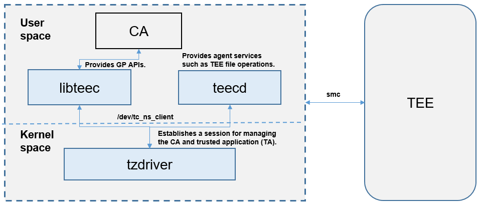

# itrustee\_ree\_lite

-   [Introduction](#section469617221261)
-   [Architecture](#section15884114210197)
-   [Directory Structure](#section1464106163817)

## Introduction

The itrustee\_ree\_lite module provides a set of rich execution environment \(REE\) API components for interacting with Huawei-developed TEEOS, including tzdriver \(driver\), libteec \(API library\), and teecd \(agent service\). libteec meets the GlobalPlatform \(GP\) standards and provides ClientApp \(CA\) APIs.

## Architecture

The following figure shows the itrustee\_ree\_lite architecture.

-   tzdriver: enables switching and communication between the REE and trusted execution environment \(TEE\) and provides device nodes that can be accessed from the application layer.

-   libteec: provides CA GP APIs for accessing device nodes and establishing communication sessions with the TEE.

-   teecd: provides agent services for TEEOS, such as file operations.

## Directory Structure

**Table  1**  Directory structure of itrustee\_ree\_lite

<table><thead align="left"><tr id="row7977610131417"><th class="cellrowborder" valign="top" width="50%" id="mcps1.2.3.1.1">
Name

</th>
<th class="cellrowborder" valign="top" width="50%" id="mcps1.2.3.1.2">
Description

</th>
</tr>
</thead>
<tbody><tr id="row17977171010144"><td class="cellrowborder" valign="top" width="50%" headers="mcps1.2.3.1.1 ">
device/hisilicon/itrustee/itrustee_ree_lite/frameworks/libteec

</td>
<td class="cellrowborder" valign="top" width="50%" headers="mcps1.2.3.1.2 ">
Implementation code of libteec

</td>
</tr>
<tr id="row6978161091412"><td class="cellrowborder" valign="top" width="50%" headers="mcps1.2.3.1.1 ">
device/hisilicon/itrustee/itrustee_ree_lite/interfaces/innerkits/libteec

</td>
<td class="cellrowborder" valign="top" width="50%" headers="mcps1.2.3.1.2 ">
APIs of libteec

</td>
</tr>
<tr id="row6978201031415"><td class="cellrowborder" valign="top" width="50%" headers="mcps1.2.3.1.1 ">
device/hisilicon/itrustee/itrustee_ree_lite/services/teecd

</td>
<td class="cellrowborder" valign="top" width="50%" headers="mcps1.2.3.1.2 ">
Implementation code of teecd

</td>
</tr>
<tr id="row1897841071415"><td class="cellrowborder" valign="top" width="50%" headers="mcps1.2.3.1.1 ">
drivers/liteos/tzdriver/

</td>
<td class="cellrowborder" valign="top" width="50%" headers="mcps1.2.3.1.2 ">
Implementation code of tzdriver

</td>
</tr>
</tbody>
</table>

