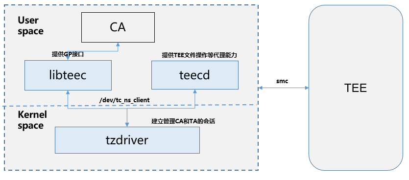

# 模块介绍

-   [简介](#section469617221261)
-   [架构](#section15884114210197)
-   [目录](#section1464106163817)

## 简介

itrustee\_ree\_lite组件提供了一套用于和华为自研TEEOS交互的富运行环境（REE）接口组件，包括驱动（tzdriver）、libteec（应用接口库）、teecd（agent服务），其中libteec满足Globalplatform 标准，可提供CA（ClientApp）标准的访问接口。

## 架构

itrustee\_ree\_lite组件结构：

-   tzdriver：驱动用于ree/tee切换、通讯，提供应用层访问的设备节点。

-   libteec: 提供CA标准GP接口，用于访问设备节点、建立与TEE的通讯会话。

-   teecd：提供agent（代理服务），帮助TEEOS实现文件操作等代理服务。

## 目录

**表 1**  itrustee\_ree\_lite源代码目录结构

<table><thead align="left"><tr id="row7977610131417"><th class="cellrowborder" valign="top" width="50%" id="mcps1.2.3.1.1">
名称

</th>
<th class="cellrowborder" valign="top" width="50%" id="mcps1.2.3.1.2">
描述

</th>
</tr>
</thead>
<tbody><tr id="row17977171010144"><td class="cellrowborder" valign="top" width="50%" headers="mcps1.2.3.1.1 ">
device/hisilicon/itrustee/itrustee_ree_lite/frameworks/libteec

</td>
<td class="cellrowborder" valign="top" width="50%" headers="mcps1.2.3.1.2 ">
libteec组件的实现代码

</td>
</tr>
<tr id="row6978161091412"><td class="cellrowborder" valign="top" width="50%" headers="mcps1.2.3.1.1 ">
device/hisilicon/itrustee/itrustee_ree_lite/interfaces/innerkits/libteec

</td>
<td class="cellrowborder" valign="top" width="50%" headers="mcps1.2.3.1.2 ">
libteec组件的接口定义

</td>
</tr>
<tr id="row6978201031415"><td class="cellrowborder" valign="top" width="50%" headers="mcps1.2.3.1.1 ">
device/hisilicon/itrustee/itrustee_ree_lite/services/teecd

</td>
<td class="cellrowborder" valign="top" width="50%" headers="mcps1.2.3.1.2 ">
teecd组件的实现代码

</td>
</tr>
<tr id="row1897841071415"><td class="cellrowborder" valign="top" width="50%" headers="mcps1.2.3.1.1 ">
drivers/liteos/tzdriver/

</td>
<td class="cellrowborder" valign="top" width="50%" headers="mcps1.2.3.1.2 ">
tzdriver驱动的实现代码

</td>
</tr>
</tbody>
</table>

